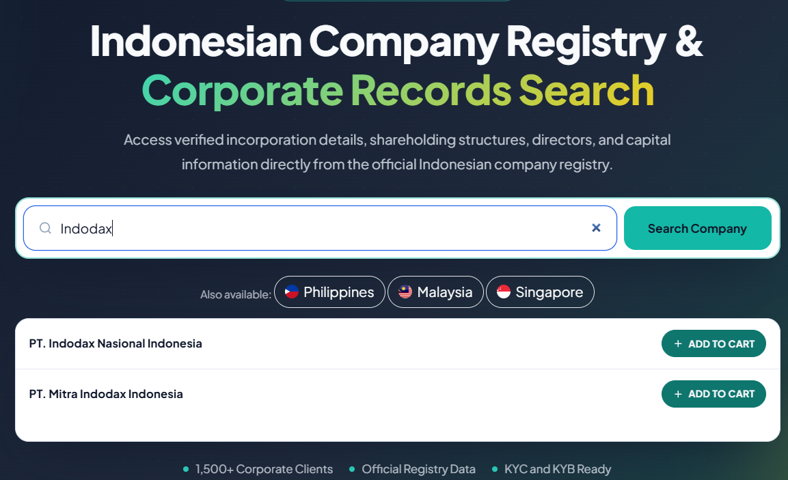
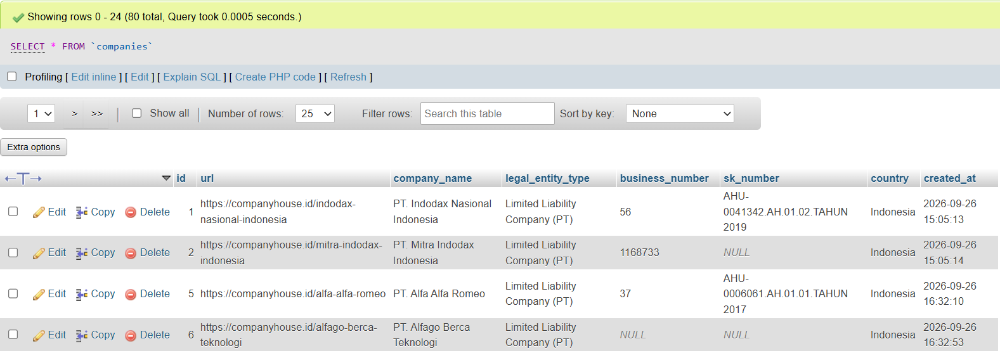

# Business Registry Data Pipeline

I built this to pull structured company data out of Indonesia's business registry site without doing it by hand search-by-search. The site sits behind Cloudflare, so this isn't a plain requests + BeautifulSoup job it drives a real browser with Selenium, waits out the verification challenge when it shows up, then parses and stores whatever it finds.

## Demo

**Search interface & results:**


**Console output:**


**Scraped data (MySQL):**


## What it does

You give it a list of search terms (one per line, in `data/search_terms.txt`), and it goes through each one, paginating up to a configurable limit so a broad term doesn't send it crawling through thousands of results. Every record gets validated at the field level before it's written anywhere.

Storage-wise, it writes to MySQL with upsert logic so re-running the same search terms later doesn't duplicate rows, it just updates what's changed and also dumps a deduplicated JSON export alongside it, in case you want the raw data without touching the database. Everything gets logged, both to console and to a log file, and the parsing logic has unit test coverage against synthetic HTML fixtures (including the annoying edge cases: missing fields, malformed rows, incomplete data).

## Tech Stack

- Python 3
- Selenium (browser automation)
- BeautifulSoup4 (HTML parsing)
- MySQL Connector/Python
- pytest (testing)

## Project Structure

```
business-registry-data-pipeline/
├── data/
│   └── search_terms.txt      # one search term per line
├── output/
│   └── companies.json        # scraped results (generated)
├── logs/
│   └── scraper.log           # runtime logs (generated)
├── src/
│   ├── config.py             # centralized configuration
│   ├── logger_config.py      # logging setup
│   ├── scraper.py            # Selenium scraping logic
│   ├── parser.py             # HTML parsing / data extraction
│   ├── database.py           # MySQL persistence layer
│   ├── exceptions.py         # custom exception types
│   └── main.py               # entry point
├── tests/
│   └── test_parser.py
├── .env.example
├── requirements.txt
└── README.md
```

## Setup

1. Clone the repository and install dependencies:

   ```bash
   pip install -r requirements.txt
   ```

2. Copy `.env.example` to `.env` and fill in your database credentials:

   ```bash
   cp .env.example .env
   ```

3. Drop your search terms into `data/search_terms.txt`, one per line:

   ```
   Indodax
   Alfa
   ```

## Usage

```bash
python src/main.py
```

First run, a Chrome window pops up. If the site throws a Cloudflare verification challenge at you, just complete it manually in that window the scraper is watching for it and picks back up on its own once you're through.

After it runs, you'll have:
- New/updated rows in the `companies` MySQL table
- A fresh export at `output/companies.json`
- A full run log at `logs/scraper.log`

## Configuration

Everything tunable lives in environment variables (see `.env.example`):

| Variable | Default | Description |
|---|---|---|
| `MAX_PAGES` | 20 | Max search-result pages to crawl per search term |
| `SEARCH_TIMEOUT` | 30 | Selenium element wait timeout (seconds) |
| `SECURITY_CHECK_TIMEOUT` | 180 | Max wait for manual Cloudflare verification |
| `PAGINATION_TIMEOUT` | 45 | Max wait for a page transition during pagination |

## Testing

```bash
pytest tests/ -v
```

## Design Notes

- **Why Selenium instead of a plain HTTP client**. The target site is Cloudflare-protected, and sometimes that means an actual human has to click through a verification screen. There's no getting around that with raw requests you need a real browser context.
- **Upsert instead of plain insert**. Early on I was just inserting rows, which meant running the same search term twice gave me duplicate companies. Made the `url` column unique and switched to upsert now overlapping search terms just update the existing record instead of cloning it.
- **Why pagination is capped**. Some search terms are broad enough to return thousands of hits. `MAX_PAGES` exists so a vague term doesn't turn into an unbounded crawl.
- **Pagination detection checks the whole result set, not just the first row**. This one came from an actual bug I originally checked whether the first result on a page had changed to decide if pagination succeeded, but partial page updates would sometimes change the first row without the page actually having moved on, giving false positives. Comparing the full set of result URLs on the page fixed it.

## Known Limitations

- The first Cloudflare challenge needs manual interaction this is intentional, not a shortcut I haven't gotten to. This project doesn't try to bypass CAPTCHA verification.
- It's selector-based, so it's tied to the site's current DOM. If they redesign the frontend, expect to update the selectors.